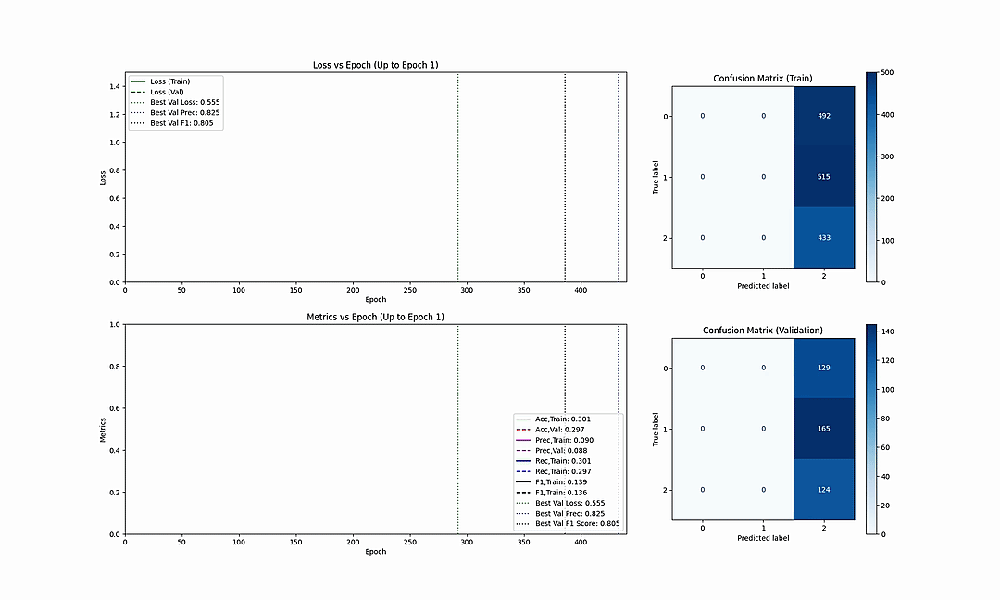

# lake-vision
Framework for tracking supraglacial lake evolution.  Developed for Greenland.  Applicable globally.

Note: This repo is under active development

## Introduction
Introduction...

## Installation
Installation guide...

## Training



## Data Pipeline

The data preprocessing pipeline combines multi-source lake data into standardized NetCDF files for training and inference.

### Data Sources

- **Imagery timestacks**: Sentinel-2 satellite imagery sequences (`lakevision/data/samples/imgseqs/`)
  - Format: `.nc` files with reflectance bands (red, green, blue, nir, swir16, swir22, mask)
  - Temporal resolution: ~153 observations per lake (May-September 2019)
  - Spatial resolution: 512×512 pixels at 10m/pixel

- **Area sequences**: Lake water area time series from [Dunmire et al. 2025](https://zenodo.org/records/14587026)
  - Format: Single `.nc` file with daily water area measurements
  - Variables: `S2_water` (Sentinel-2 derived water area)
  - Temporal coverage: Full year 2019

### Preprocessing Functions

The [lakevision/data/preprocessing.py](lakevision/data/preprocessing.py) module provides utilities for:

1. **Loading and filtering data**:
   - `load_area_sequences()`: Load and filter area data by lake ID and date range
   - `load_imagery_timestack()`: Load imagery with optional band selection
   - `filter_lakes_by_substring()`: Filter lakes by ID pattern (e.g., 'CW2019')

2. **Extracting channels**:
   - `extract_rgb_channels()`: Extract RGB bands from imagery
   - `extract_mask_channel()`: Extract lake mask/SCL band

3. **Time series processing**:
   - `fill_nan_timeseries()`: Fill missing values (forward/backward fill or interpolation)
   - `align_water_area_to_imagery()`: Align daily area data to imagery timestamps
   - `get_lake_water_area()`: Extract and process water area for a single lake

4. **Combining data**:
   - `combine_lake_data()`: Merge imagery and area data into single standardized `.nc` file

### Combined Dataset Format

Each processed lake is saved as a single `.nc` file with the following structure:

```python
xr.Dataset {
    dimensions:
        time: 153      # number of observations
        channel: 7     # RGB + NIR + SWIR16 + SWIR22 + mask
        y: 512         # image height
        x: 512         # image width

    data_vars:
        imagery (time, channel, y, x): float32
            # 4D image sequences [red, green, blue, nir, swir16, swir22, mask]

        water_area (time,): float32
            # 1D water area time series (NaNs filled)

        cloudy_seq_rgb (time,): float32
            # Tile usefulness predictions from RGB model (0=cloudy, 1=useful)

        cloudy_seq_rgbn (time,): float32
            # Tile usefulness predictions from RGB+NIR model

        cloudy_seq_bns16 (time,): float32
            # Tile usefulness predictions from B+NIR+SWIR16 model

    coords:
        time: datetime64[ns]
        channel: ['red', 'green', 'blue', 'nir', 'swir16', 'swir22', 'mask']
        lake_id: str
}
```

### Usage Example

```python
from lakevision.data.preprocessing import load_area_sequences, combine_lake_data

# Load area data for all CW2019 lakes (May-September 2019)
area_ds = load_area_sequences(
    'lakevision/data/samples/areaseqs/all_lakes_2019.nc',
    start_date='2019-05-01',
    end_date='2019-09-30'
)

# Combine imagery and area data for a single lake
ds = combine_lake_data(
    imagery_path='lakevision/data/samples/imgseqs/tstack_CW2019_1579.nc',
    area_ds=area_ds,
    lake_id='CW2019_1579',
    output_path='lakevision/data/samples/processed/CW2019_1579.nc'
)

print(ds['imagery'].shape)      # (153, 7, 512, 512)
print(ds['water_area'].shape)   # (153,)
print(ds['cloudy_seq_rgb'].shape)  # (153,) - tile usefulness from cloudy-tile model
```

## Model Architecture

The `LakeDrainageClassifier` is a multi-stream temporal model that processes satellite imagery sequences and/or scalar time series to classify lake drainage events.

```
Input Streams (configurable):
├── Image Sequence [B, T, C, H, W] ──► FrontCNN ──► CLSTM ──► GlobalPooling ──► features
├── Area Sequence [B, T, 1] ─────────────────────► ScalarLSTM ─────────────► features
└── Cloudy Sequence [B, T, 1] ────────────────────► ScalarLSTM ─────────────► features
                                                                                  │
                                                          concatenate ◄──────────┘
                                                              │
                                                              ▼
                                                        ClassHeadMLP
                                                              │
                                                              ▼
                                                      logits [B, num_classes]

Where:
  B = batch size
  T = sequence length (number of timesteps)
  C = channels (3-7 depending on spectral bands: RGB + optional NIR/SWIR16/SWIR22 + mask)
  H, W = spatial dimensions (512×512)
```

### Configurable Hyperparameters

#### Input Streams
| Parameter | Options | Default | Description |
|-----------|---------|---------|-------------|
| `use_imgseq` | True/False | True | Use satellite imagery sequence |
| `use_areaseq` | True/False | True | Use water area time series |
| `use_cloudyseq` | True/False | False | Use cloudy tile usefulness sequence |
| `use_nir` | True/False | False | Include NIR band in imagery |
| `use_swir16` | True/False | False | Include SWIR16 band in imagery |
| `use_swir22` | True/False | False | Include SWIR22 band in imagery |

#### Band Statistics (Normalization)

When using multi-spectral bands, per-band mean/std normalization is recommended via the `band_stats` parameter in `LakeDataset`. This normalizes each band to zero mean and unit variance:

```python
dataset = LakeDataset(
    data_paths="/path/to/nc/files",
    band_stats="/path/to/band_stats.json",  # Per-band normalization
    use_nir=True,
    use_swir16=True,
)
```

The `band_stats.json` file format:
```json
{
    "red": {"mean": 1234.5, "std": 567.8},
    "green": {"mean": 1100.2, "std": 498.3},
    ...
}
```

On Sherlock: `/oak/stanford/groups/cyaolai/JoshRines/data/cloudytile/band_stats.json`

#### Learned Temporal Weights
| Parameter | Options | Default | Description |
|-----------|---------|---------|-------------|
| `learn_area_weights` | True/False | False | Learn per-timestep weights for area sequence |
| `learn_cloudy_weights` | True/False | False | Learn per-timestep weights for cloudy sequence |
| `seq_len` | 32, 153, ... | 153 | Sequence length (needed when learn_*_weights=True) |

#### FrontCNN (Image Feature Extraction)
| Parameter | Options | Default | Description |
|-----------|---------|---------|-------------|
| `cnn_base_channels` | 8, 16, 32 | 8 | Base channel count (doubles each layer) |
| `cnn_num_layers` | 2, 3, 4 | 3 | Number of conv layers |
| `cnn_out_hw` | (8,8), (16,16), (32,32) | (32,32) | Output spatial dimensions |
| `cnn_pool` | 'max', 'avg' | 'max' | Pooling type |

#### CLSTM (Spatiotemporal Processing)
| Parameter | Options | Default | Description |
|-----------|---------|---------|-------------|
| `clstm_hidden_dim` | 16, 32, 64 | 32 | Hidden state dimension |
| `clstm_num_layers` | 1, 2, 3 | 1 | Number of stacked CLSTM layers |

#### Attention Mechanisms
| Parameter | Options | Default | Description |
|-----------|---------|---------|-------------|
| `attention_type` | 'none', 'spatial', 'full', 'arch' | 'none' | Type of attention |
| `global_pool_type` | 'avg', 'max', 'both' | 'avg' | Global pooling method |

**Attention types explained:**
- **none**: No attention, direct CLSTM output
- **spatial**: CBAM spatial attention only (learns *where* to focus)
- **full**: CBAM channel + spatial attention (learns *what* features and *where*)
- **arch**: Architecture-specific attention modifications

**Global pooling types explained:**

After the CLSTM processes the sequence, the final hidden state has shape `[B, C_hidden, H, W]`. GlobalPooling reduces the spatial dimensions to produce a fixed-size feature vector:
- **avg**: Average pooling over spatial dimensions → `[B, C_hidden]`
- **max**: Max pooling over spatial dimensions → `[B, C_hidden]`
- **both**: Concatenates avg and max pooled features → `[B, 2*C_hidden]`

#### ScalarLSTM (Time Series Processing)

Processes 1D scalar sequences (water area, cloud fraction) through standard LSTM layers. The model supports multiple input stream configurations:

| Configuration | Description |
|---------------|-------------|
| `use_imgseq=True, use_areaseq=True` | Full model: imagery + area sequences (default) |
| `use_imgseq=True, use_areaseq=False` | Imagery only: spatial-temporal features |
| `use_imgseq=False, use_areaseq=True` | Area only: lightweight baseline using just water area time series |
| `use_imgseq=True, use_areaseq=True, use_cloudyseq=True` | All streams: adds cloud fraction |

**Area-only mode** is useful as a baseline or when imagery is unavailable. The water area time series alone can capture drainage signatures (rapid area decrease = drainage event).


#### ClassHeadMLP (Classification)
| Parameter | Options | Default | Description |
|-----------|---------|---------|-------------|
| `mlp_hidden_dims` | None, 32, 64, [64,32] | 64 | Hidden layer dimensions |
| `mlp_dropout` | 0.0 - 0.5 | 0.0 | Dropout probability |
| `mlp_activation` | 'relu', 'leakyrelu', 'gelu' | 'relu' | Activation function |
| `num_classes` | 4, 5, ... | 4 | Number of output classes |

### Training Hyperparameters

| Parameter | Typical Range | Description |
|-----------|---------------|-------------|
| `seq_len` | 11, 21, 31, 51 | Temporal sequence length |
| `batch_size` | 2, 4, 8, 16 | Batch size |
| `learning_rate` | 1e-5 to 1e-3 | Learning rate |
| `weight_decay` | 0, 1e-5, 1e-4 | L2 regularization |
| `epochs` | 50-200 | Training epochs |


### Model Inference
Model inference information

## Tests

The project includes comprehensive test coverage for all core components. Tests are written using pytest and located in the [lakevision/tests](lakevision/tests) directory.

### Running Tests

To run all tests:
```bash
pytest lakevision/tests/
```

To run tests for a specific module:
```bash
pytest lakevision/tests/test_attention.py
pytest lakevision/tests/test_clstm.py
pytest lakevision/tests/test_blocks.py
pytest lakevision/tests/test_classifier.py
```

To run tests with verbose output:
```bash
pytest lakevision/tests/ -v
```

To run a specific test function:
```bash
pytest lakevision/tests/test_attention.py::TestSpatialCBAM::test_basic_forward
```

### Test Coverage

The test suite covers:
- **Attention mechanisms** ([test_attention.py](lakevision/tests/test_attention.py)): SpatialCBAM and FullCBAM
- **Convolutional LSTM** ([test_clstm.py](lakevision/tests/test_clstm.py)): CellCLSTM and CLSTM
- **Building blocks** ([test_blocks.py](lakevision/tests/test_blocks.py)): ScalarLSTM, ClassHeadMLP, GlobalPooling
- **Full classifier** ([test_classifier.py](lakevision/tests/test_classifier.py)): LakeDrainageClassifier (integrated model)
- **Dataset loading** ([test_datasets.py](lakevision/tests/test_datasets.py)): LakeDataset class for loading processed NetCDF files
- **End-to-end training** ([test_training.py](lakevision/tests/test_training.py)): Full training pipeline (data loading → forward pass → loss → backward pass)
